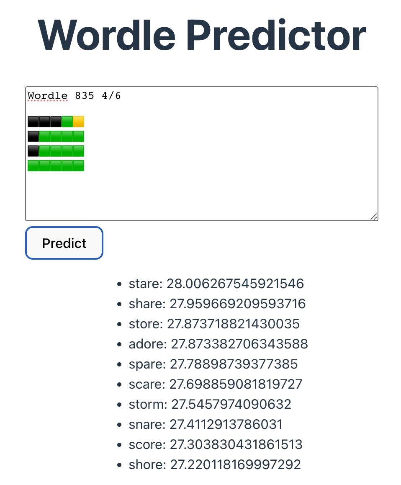

# wordle-guess

An experiment to predict the initial guesses in Wordle using its Share output. It extracts the Wordle number, retrieves the day's answer, and then calculates word scores.

The scoring hinges on a few factors:
- Block colors in each guess, which filter out or de-prioritize certain words.
- Word usage frequency in English, derived from the [Wortschatz](https://wortschatz.uni-leipzig.de/en/download/English) dataset.
- Common Wordle [starting guesses](https://www.nytimes.com/interactive/2022/upshot/wordle-bot.html).

